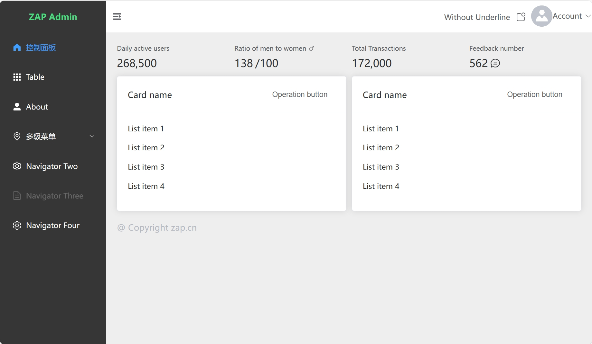

# vue-zap-admin

**中文**

## 介绍
vue-zap-admin 是一个基于 `element-plus` 免费开源的后台模版。使用了最新的`vue3`，`vite`,`pinia`等主流技术，可作为后台开发模版或学习参考。仅包含关键的布局菜单等常用功能，方便集成。

## 项目主页
- [vue-zap-admin](https://zap.cn/vue-zap-admin) - ZAP.CN
- [vue-zap-admin](https://github.com/zapj/vue-zap-admin) - Github

## IDE 推荐

[VSCode](https://code.visualstudio.com/) + [Volar](https://marketplace.visualstudio.com/items?itemName=Vue.volar) (and disable Vetur) + [TypeScript Vue Plugin (Volar)](https://marketplace.visualstudio.com/items?itemName=Vue.vscode-typescript-vue-plugin).

## Customize configuration

See [Vite Configuration Reference](https://vitejs.dev/config/).

## 如何使用

```sh
npm install
```

### 开发

```sh
npm run dev
```

### 编译发布

```sh
npm run build
```

### Lint with [ESLint](https://eslint.org/)

```sh
npm run lint
```


## 预览


